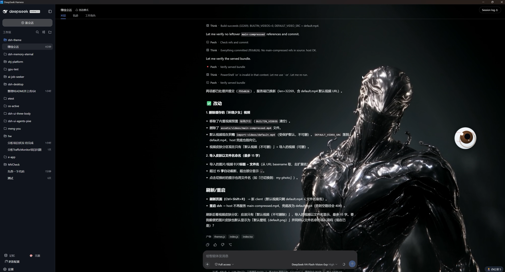

<p align="center">
  
</p>

<div align="center">
  <h1 align="center">@eternalnight/dsh-theme</h1>
  <p><strong>DeepSeek Harness Theme Skin Plugin</strong></p>
  <p>
    <a href="https://www.npmjs.com/package/@eternalnight/dsh-theme"></a>
    <a href="LICENSE"></a>
    <a href="https://github.com/EternalNight996/dsh-theme"></a>
  </p>
  <p><a href="README.md">简体中文</a> | <strong>English</strong></p>
  <p>🎨 Give the DeepSeek Harness web GUI a new look: built-in themes / static image / dynamic 360°-follow video, one-click from the sidebar, full management in Settings. <strong>One command to install; no dsh source changes.</strong></p>
</div>

<p align="center">
  
  <br/>
  <em>Desktop: background showing through + theme panel + light/dark</em>
</p>

---

## 🚀 Install

```bash
# npm (published)
dsh plugin --profile web add @eternalnight/dsh-theme

# from GitHub
dsh plugin --profile web add github:EternalNight996/dsh-theme

# local link
dsh plugin --profile web add F:/MyApp/eternal/dsh-theme
```

After install **restart dsh web**: a 🎨 Theme button appears at the sidebar foot and a top-level "Theme" section appears in Settings (default wallpaper shown by default).

---

## ✨ Features

### Three skin modes (mutually exclusive)

| Mode | Description |
| --- | --- |
| **Built-in** | 4 app color schemes (Dark/Graphite/Light/Sakura) + backdrop skins (Aurora etc.) |
| **Image** | Import local png/jpg/webp, persisted to `assets/import-images/`, **named by filename (≤15 chars)**, deletable |
| **Video** | **Follow-mouse** (360° orbit) / **loop**; default `import-videos/default.mp4`, import persisted + deletable |

### 🎥 Video · two modes

- **Follow-mouse**: mouse X → video `currentTime`; `rAF` shortest-path lerp (no jump across ±π), throttled seeks + threshold, smooth on 1080p; stops under `prefers-reduced-motion`.
- **Loop**: autoplay looping background.
- Background layer is `pointer-events: none`, never blocks interaction.

### Protected default skins

- `import-images/default.png` and `import-videos/default.mp4` are **non-deletable defaults**.

### Adjustable transparency

- Independent sliders for **theme-panel opacity**, **dialog opacity**, **background dim**; settings/sidebar/topbar stay solid independently.

### Entry points

- Sidebar footer 🎨 button (rail shows icon only) → theme panel.
- **Settings → Theme** (top-level, id `dsh-theme`, order 25).
- Persisted in the `dsh-theme` namespace, survives restart.
- All UI uses `var(--dsw-alias-*)`, light/dark native.

---

## 🛠 Build

> After install you can edit the frontend source and rebuild.

```bash
npm install
npm run build        # only needed when editing src/client
npm run gen:bg       # regenerate built-in backgrounds (optional)
# index.js / lib/themes.js need no build; just restart
```

---

## 📜 Changelog

- **v0.1.2** Separate zh/en docs: `README.md` (Chinese) & `README.en.md` (English), with language switcher at top.
- **v0.1.1** README redesign: MVCheck-style centered banner + badges + showcase assets at front; roadmap; changelog; marketplace-ready (GitHub topics `dsh-plugin` etc.).
- **v0.1.0** Initial release: background layer, Settings → Theme, sidebar 🎨 button; three skin modes (built-in / image / 360°-follow video); video follow-mouse & loop; adjustable transparency (panel / dialog / dim); import persistence to `import-images`/`import-videos` + two-step delete; non-deletable `default.png`/`default.mp4`; filename-named skins (≤15 chars); font/buttons adapt to DSH appearance; follow-mouse perf (throttled seeks / background pause / idle stop).

---

## 🗺 Roadmap

- [ ] Recent-imports ordering & "recently used" badge.
- [ ] i18n for the panel (en/zh now, more languages later).
- [ ] Per-workspace theme memory.
- [ ] Import/export custom CSS token themes.
- [ ] Manual motion-strength level (besides `prefers-reduced-motion`).
- [ ] Drag-and-drop import.
- [ ] Live frame thumbnail preview in follow mode.

---

## 📄 License

MIT

---

> Give DSH a background you love, so it feels different every day.
