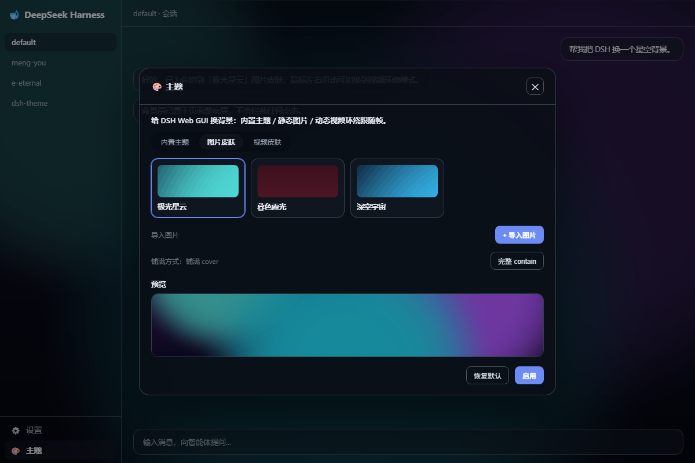
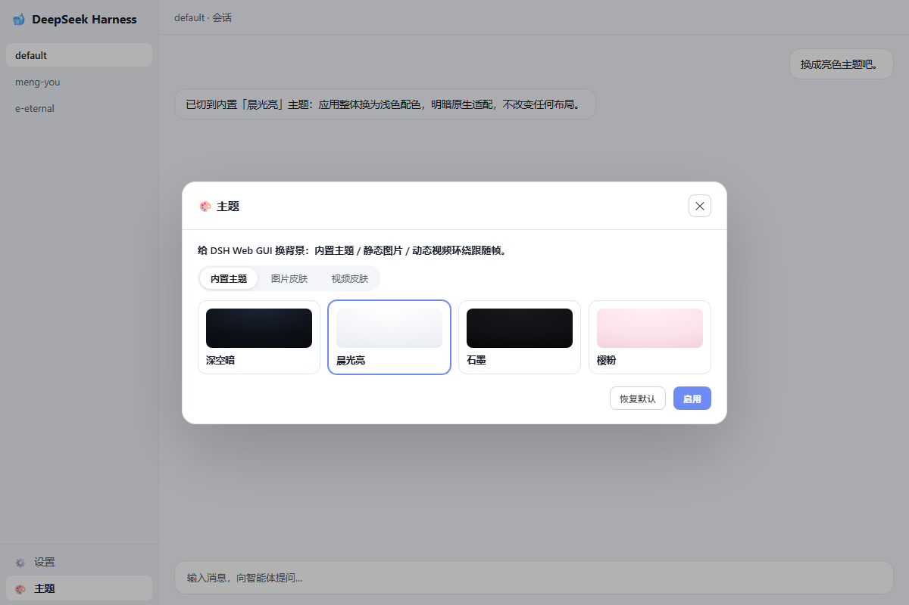

# dsh-ui-deep-theme 主题皮肤

> 🎨 **给 DeepSeek Harness 的 Web GUI 换背景**：内置主题 / 静态图片 / 动态视频（鼠标环绕跟随帧）三种皮肤形态，侧边栏底部一键切换，设置页完整管理。**一条命令安装，不改 dsh 源码。**

---

## 🖼 效果预览

<p align="center">
  
  <br/>
  <em>暗色模式 + 「极光星云」图片皮肤：背景透出，界面文字/控件自动加遮罩保证可读</em>
</p>

<p align="center">
  
  <br/>
  <em>亮色内置主题（晨光亮） + 设置 → 主题 面板：内置列表 / 导入图片视频 / 预览</em>
</p>

---

## 🚀 安装

```bash
# 已发布后（npm）
npx @deepseek-ai/dsh plugin --profile web add dsh-ui-deep-theme

# 从 GitHub
npx @deepseek-ai/dsh plugin --profile web add github:EternalNight996/dsh-ui-deep-theme

# 本地联调（link 本地目录，改代码即时生效）
npx @deepseek-ai/dsh plugin --profile web add F:/MyApp/eternal/dsh-theme
```

装完**重启 dsh web**：侧边栏底部出现「🎨 主题」按钮，设置页出现顶层「主题」分区。

---

## ✨ 功能

### 三种皮肤形态（互斥启用）

| 形态 | 说明 |
| --- | --- |
| **内置主题** | 4 套应用配色（深空暗 / 石墨 / 晨光亮 / 樱粉），换色不换布局，明暗原生适配 |
| **静态图片** | 3 张内置预设（极光星云 / 暮色霞光 / 深空宇宙）+ 导入本地图（png/jpg/webp） |
| **动态视频** | 默认 `main-compressed.mp4`（1080p 压缩版环绕素材）+ 导入视频（mp4/webm） |

### 🎥 动态视频 · 鼠标环绕跟随帧

- 鼠标横向位置 → 视频 `currentTime`，绕屏幕中心转一圈角色随之转向
- `rAF` 里对归一化时间做**最短路径 lerp**（wrap 到 `[-0.5, 0.5]`），跨 ±π 边界不跳变
- 目标时差足够大才真正 seek（~16Hz + 位移阈值），1080p 下不卡顿
- `prefers-reduced-motion` 下不驱动，视频停在初始朝向
- 背景层 `pointer-events: none`，**绝不拦截任何交互**；mousemove 挂在 window

### 入口

- **侧边栏底部**「🎨 主题」按钮（rail 窄条态仅图标）→ 主题面板弹窗（快切 / 导入 / 预览）
- **设置 → 主题** 顶层分区（id: `deep-theme`, order: 25）
- 当前主题持久化到 `deep-theme` 设置命名空间，**重启保留**
- 全部自定义 UI 用 `var(--dsw-alias-*)`，明暗原生适配

---

## 📁 目录结构

```
dsh-ui-deep-theme/
├── index.js              # host 插件：settings 命名空间 + 静态资源 + 导入持久化
├── lib/
│   ├── client.js         # client bundle（构建产物，__ModuleLoader__ 格式）
│   └── themes.js         # 内置主题定义（token / 背景色 / 预设图）
├── src/
│   └── client/index.tsx  # client 源码：背景层 + 设置分区 + footer 按钮 + 360 跟随
├── assets/
│   ├── backgrounds/      # 内置默认图片（aurora / sunset / deep-space）
│   ├── videos/
│   │   └── main-compressed.mp4  # 默认视频（拷贝自 meng-you，1080p 压缩版）
│   └── imports/          # 用户导入的图片/视频（运行时写入）
├── cordis.patch.yml      # bundle 补丁层（host 行，安装自动挂载）
├── build.mjs             # esbuild 构建脚本（TSX → lib/client.js）
├── scripts/gen-bgs.ps1   # 内置背景图生成脚本
├── package.json          # dsh.client + dsh.bundle.patch 清单
└── README.md
```

---

## 🛠 开发 / 构建

```bash
npm install
npm run build        # 只改 client（src/client）时需要
npm run gen:bg       # 重新生成内置背景图
# 改 index.js / lib/themes.js 无需构建，重启即生效
```

## 🗺 待办 / 路线图

- [ ] **更多内置视频/图片素材**：提供多套环绕素材与抽象背景
- [ ] **按会话/工作区记忆主题**：不同会话记住各自主题
- [ ] **自定义 CSS 主题**：导入/导出完整主题 token 方案
- [ ] **动效强度分级**：除 `prefers-reduced-motion` 外提供手动档位

## 📄 License

MIT

---

> 换上喜欢的背景，让 DSH 每天都不一样。🎨
